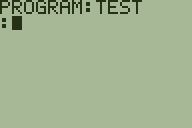

# TIDE
This is the start of an IDE for the monochrome TI-83+/84+ series of calculators.

Here is a current example, in which we see the cursor doesn't blink correctly
(a copy of the current char isn't being properly saved), but it does properly
edit `prgmTEST`! It can even rename groups of tokens in a way not achievable in
a token hook. For example, `I` is a token, and so is `Line(`, but we can read
them together as their own token, `InvertLine(`:

**

# To Build
I use [spasm-ng](https://github.com/alberthdev/spasm-ng) to compile this
project. For other compilers, you may need some tweaking and you'll probably
need to figure out an app signing tool.

In order to build this project, you will also need the
[Z80 Optimized Routines](https://github.com/Zeda/Z80-Optimized-Routines)
repository in the same directory as TIDE. You probably don't need the whole
repository history, so you can do:
```
git clone --depth 1 https://github.com/Zeda/TIDE.git
git clone --depth 1 https://github.com/Zeda/Z80-Optimized-Routines.git
```
But if you do want the whole history, just omit the `--depth 1`.

Then to compile, move into the TIDE directory and either execute the compile
script:
```./compile```

Or manually do it:
```
spasm src/TIDE.z80 bin/TIDE.8xk -I src -I ../Z80-Optimized-Routines
```
